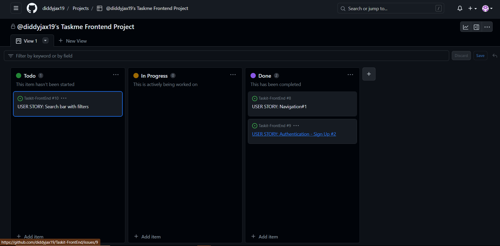
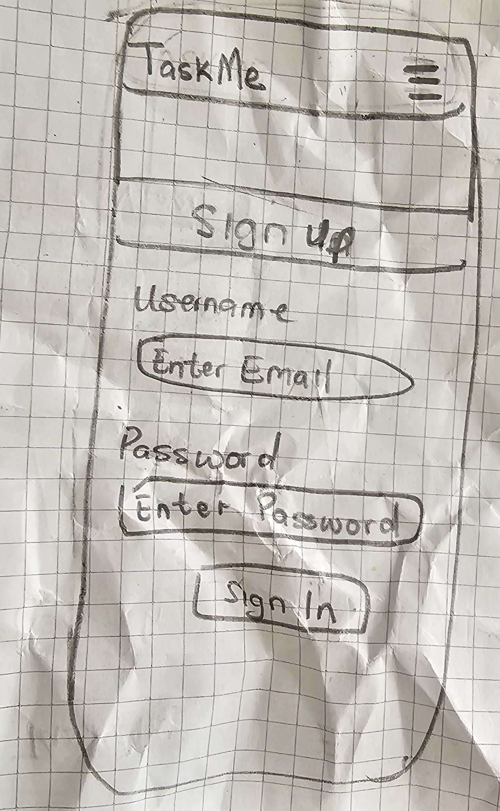
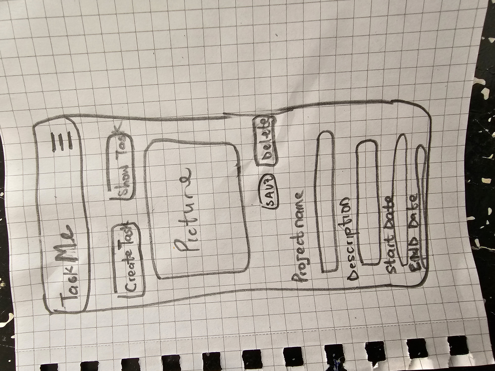
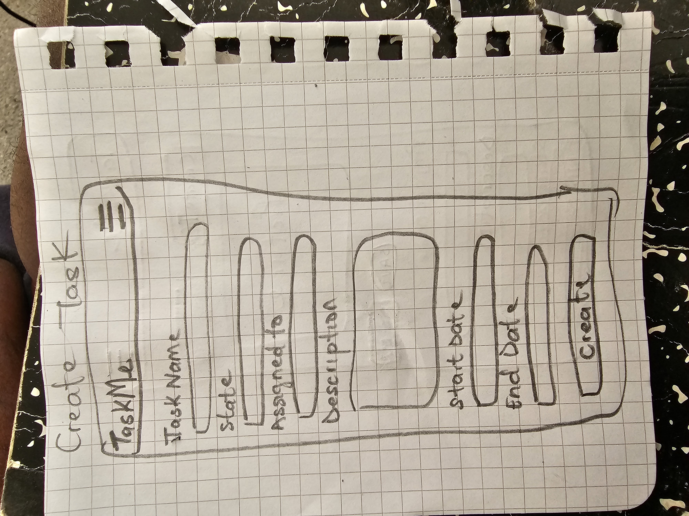
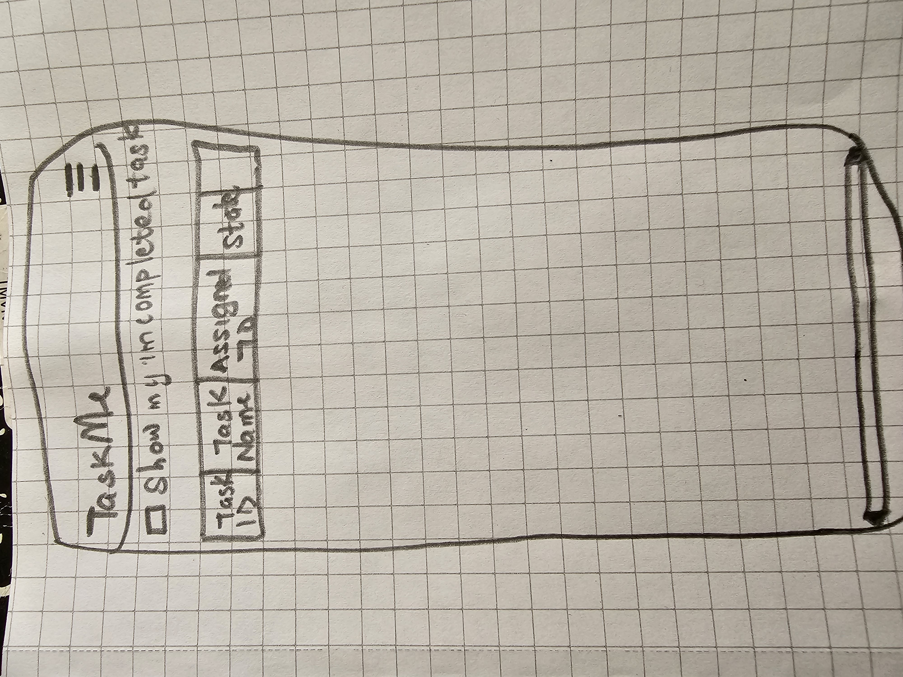

# TaskME - An Project Manager App!

## 

Taskme is one of the best productivity platforms on the market. Available via mobile app, desktop app, and web browser, TaskMe provides yet another way to improve work ethic and productivity throughout the day. With TaskMe, team members can check their to-do lists, communicate with one another in real time, collaborate on schedules,and check up on the latest project progress.
The users can register for the website and have access to more features such as Viewing the Projects and the tasks that are assignedd to all users in the group.

This part of the project is the frontend part based on the React framework, it consist of the user interface that connects and interact with the backend API through http requests.

[View the live project here.](https://taskit-frontend.netlify.app/)

### Links to the Backend API Project

- [Backend - Repository](https://github.com/diddyjax19/Project5-taskmeBackEnd)
- [Backend - Deployment](http://tobi.pythonanywhere.com/)

## Table of Contents

- [User Experience (UX)](https://github.com/diddyjax19/Taskit-FrontEnd#user-experience-ux)
  - [User Stories](https://github.com/diddyjax19/Taskit-FrontEnd#user-stories)
  - [Agile Methodology](https://github.com/diddyjax19/Taskit-FrontEnd#agile-methodology)
  - [Design](https://github.com/diddyjax19/Taskit-FrontEnd#design)
  - [Wireframes](https://github.com/diddyjax19/Taskit-FrontEnd#wireframes)
- [Features](https://github.com/diddyjax19/Taskit-FrontEnd#features)
  - [Future Features](https://github.com/diddyjax19/Taskit-FrontEnd#future-features)
- [Technologies Used](https://github.com/diddyjax19/Taskit-FrontEnd#technologies-used)
  - [Languages Used](https://github.com/diddyjax19/Taskit-FrontEnd#languages-used)
  - [Frameworks Used](https://github.com/diddyjax19/Taskit-FrontEnd#frameworks-used)
- [Testing](https://github.com/diddyjax19/Taskit-FrontEnd#testing)
  - [Bugs](https://github.com/diddyjax19/Taskit-FrontEnd#bugs)
    - [Fixed Bugs](https://github.com/diddyjax19/Taskit-FrontEnd#fixed-bugs)
    - [Remaining Bugs](https://github.com/diddyjax19/Taskit-FrontEnd#remaining-bugs)
- [Deployment](https://github.com/diddyjax19/Taskit-FrontEnd#deployment)
  - [Forking the GitHub Repository](https://github.com/diddyjax19/Taskit-FrontEnd#forking-the-github-repository)
  - [Making a Local Clone](https://github.com/diddyjax19/Taskit-FrontEnd#making-a-local-clone)
  - [Deploying with Heroku](https://github.com/diddyjax19/Taskit-FrontEnd#deploying-with-heroku)
- [Credits]https://github.com/diddyjax19/Taskit-FrontEnd#credits)
  - [Code](https://github.com/diddyjax19/Taskit-FrontEnd#code)
  - [Media](https://github.com/diddyjax19/Taskit-FrontEnd#media)
  - [Acknowledgments](https://github.com/diddyjax19/Taskit-FrontEnd#acknowledgments)

## User Experience (UX)

The project was created in order to offer a  Taskmanger app where users on a given network can add projects,add users to the network,create a task in the project,assign a start date and due date,set priority  and state of the project.
It also allows all user see the entire projects in the workspace and the tasks.
Some criterias in achieving this goal were identified as below:

- The main experience is to build a Task manager app .
- Registered users should be to see the projects and the task assigned to them and thier team.
- Create functionality for users search for task and projects available.
- Registered users should be view each project,view the description of the project and see the Start date and the due date.
- Registered users should be able view each task in any project,view the description of the task as they are assigned,view the tasks state and thier Start date and the due date.

### User stories

- User stories can be viewed in the GitHub repository and each user story has been grouped into Epics which can be displayed on the project's [Kanban board](https://github.com/users/diddyjax19/projects/6/views/1).

### Agile methodology

- The Agile Methodology was employed throughout this project, where GitHub projects were used to create User Stories, including a list of priorities grouped into Tags. Thus, the process can be carried out with a view to the priorities of the (supposed) client.
- A lst of all issues and its labels can be found [here](https://github.com/diddyjax19/Taskit-FrontEnd/issues).

### Design

- #### Color Scheme

  I decided to incorporate a minimalistic design approach for the site. This is in order to make the content and detailed information throughout the site to stand out better to the users.

  The main color used is black that represents a calm and trustworthy color type, in order to build trust to the user.

- #### Typography

  Google Fonts was used for the font in the project. The name of the font is Poppins with a medium font weight for a stylistic impression.

- ### Wireframes

- ##### Signup Page:

  

  - ##### SignIn Page:

  

    - ##### Create Project Page:

  

- ##### Create Task Page:

  

- ##### View Task Page:

  

## Features

### NavBar & Search

- Contains the necessary links for navigation throughout the site.
- Updates links are based on user state.
- The searchbar makes it possible search among the various listings.
- When user is using a small screen, the NavBar toggle turns into a burger icon.

### Post List page

- Shows all the posted plants offered by users.
- Provides the vital information about each plant.

### Post Detail page

- Contains the entire offer of a single plant with detailed information about it: difficulty leve, type of plant, etc.
- Includes links for the post owner to update or delete the post.

## Post Edit page

- Provides capability to update an existing plant post.

## Profile page

- The profile page gives the user the possibility to get more followers, and be between the most followed users of the plattform.
- \*\*\*This page is still being developed, and in a near future new features like "Bio" and "City" will be provided to all users. These features already can be seen at the API.

## Edit Profile

- Edit profile makes it possible to update the existing information about a user.

## Feed page

- On the Feed page all plants offered will be listed in an infinite loading process, according to the followed profiles. So the users can have the experience to scroll the screem for more and more plants.

## Liked page

- Registered users have the possibility to see their liked plants when click on "Liked" at the menu bar. All plantas that a user liked will appear on a list form.

### Future Features

Some future features were idealized to be implemented:

- Offer more search options with filters based on different criteria.
- Set the "Bio" and "city" at Profile page, in order to give the users the possibility to know the user their are following.
- Implement a star rating system for the plants offered to rate the plant offerers in order to increase trust and credibility of the community.
- Implement a location algorithm to allow users to search for plants or offeres through a certain distance, connected with the "City" field.
- To offer the functionality for an image gallery to allow the offeres to upload more pictures of the plants to give.

## Technologies Used

### Languages

- JavaScript
- HTML5
- CSS3

### Frameworks, Libraries & Programs Used

- [React](https://reactjs.org/) - (Front-end JavaScript library for building user interfaces based on UI components)
- [React Bootstrap](https://react-bootstrap.github.io/) - Component-based library that provides native Bootstrap components as pure React components[1](https://www.pluralsight.com/guides/how-to-set-up-a-react-bootstrap-app). Used to create a responsive application/component UI.
- [Axios](https://axios-http.com/) - Promise based HTTP client for the browser and node.js. Used to make HTTP requests from throughout the application.
- [jwt-decode](https://github.com/auth0/jwt-decode) - Used to decode and extract information from a JWT token.
- [react-router-dom](https://www.npmjs.com/package/react-router-dom) - Routing library for the React Javascript library. Used to display different components based on the URL entered in the browser.
- [drawSQL](https://drawsql.app/) - Create Database Schema/ERD
- [Git](https://git-scm.com/) - Git was used for version control, using the terminal to commit to Git and Push to GitHub.
- [GitHub:](https://github.com/) - GitHub is used to store the projects code after being pushed from Git.
- The following modules were installed or enabled in Gitpod to assist with formatting and code linting:

  - [ESLint](https://eslint.org/) - Code Linter.
  - [Prettier](https://prettier.io/) - Code Formatting.

## Testing

### Navigation-test

1. Access the navigation bar on every page and easily navigate to the different sections of the website. - PASS
2. Continue scrolling without pagination to find more plants. - PASS
3. Search for keywords or user's name in the search bar to find the plant or a user. - PASS

### Account-test

1. See the most followed users. - PASS
2. Click on profiles to find more information about them. - PASS
   (\*\*\* in development)
3. Edit my profile to update or change my information. - PASS

### Posts

1. Delete posts a logged in user - PASS
2. Edit posts to update information. - PASS
3. Create posts. PASS
4. Find a list of posts at the home page. - PASS
5. Click on a post and view all details. - PASS

### Authentication

1. Register account. - PASS
2. Login and logout. - PASS
3. Set the acess tokens to refresh and avoid logout of users. - PASS

## Code Validation

### JSX

The JSX code was validated during the development process and corrected as the project proceeded.

### CSS

Checked the CSS syntax at the W3C CSS Validator Service and the results came with no errors.

### Lighthouse Scores

The Lighthouse Scores of Google Dev Tools was used for perfoemance tests. The performance metrics however were impacted by the large image sizes, ahtough all of them were resized before uploaded. For future updates I will investigate possibilities to have cloudinary to resize the images on upload automatically to speed up the site.

- Main Page Desktop

- Main Page Mobile

### Responsiveness

The website was thoroughly tested using the [responsivetesttool.](https://responsivetesttool.com/)

### Bugs

#### Fixed Bugs

- Django Rest Auth Token, in which all sessions were closed suddenly.
- Small bugs like typo and misspelling through the code were solved.

#### Remaining Bugs

- MoreDropdown for post edit is showing in the "wrong" place, and should be in the right side of the container.
- City field is not being showing even when user choses a city.

## Deployment

### Forking the GitHub Repository

1.  Go to [the project repository](https://github.com/ErikHgm/FireHouse-Restaurant-Project)
2.  In the right most top menu, click the "Fork" button.
3.  There will now be a copy of the repository in your own GitHub account.

### Running the project locally

1.  Go to [the project repository](https://github.com/ErikHgm/FireHouse-Restaurant-Project)
2.  Click on the "Code" button.
3.  Choose one of the three options (HTTPS, SSH or GitHub CLI) and then click copy.
4.  Open the terminal in you IDE program.
5.  Type `git clone` and paste the URL that was copied in step 3.
6.  Press Enter and the local clone will be created.

### Alternatively by using Gitpod:

1.  Go to [the project repository](https://github.com/ErikHgm/FireHouse-Restaurant-Project)
2.  Click the green button that says "Gitpod" and the project will now open up in Gitpod.

### Deploying with Heroku

I followed the below steps using the Code Institute tutorial:

The following command in the Gitpod CLI will create the relevant files needed for Heroku to install your project dependencies `pip3 freeze --local > requirements.txt`. Please note this file should be added to a .gitignore file to prevent the file from being committed.

1.  Go to [Heroku.com](https://dashboard.heroku.com/apps) and log in; if you do not already have an account then you will need to create one.
2.  Click the `New` dropdown and select `Create New App`.
3.  Enter a name for your new project, all Heroku apps need to have a unique name, you will be prompted if you need to change it.
4.  Select the region you are working in.

#### Heroku Deployment

In the Deploy tab:

1.  Connect your Heroku account to your Github Repository following these steps:
    - Click on the `Deploy` tab and choose `Github-Connect to Github`.
    - Enter the GitHub repository name and click on `Search`.
    - Choose the correct repository for your application and click on `Connect`.
2.  You can then choose to deploy the project manually or automatically, automatic deployment will generate a new application every time you push a change to Github, whereas manual deployment requires you to push the `Deploy Branch` button whenever you want a change made.
3.  Once you have chosen your deployment method and have clicked `Deploy Branch` your application will be built and you should now see the `View` button, click this to open your application.

## Credits

### Online Documentation

- [React documentation](https://reactjs.org/docs/getting-started.html)
- [React Bootstrap documentation and examples](https://react-bootstrap.github.io/)

### Code

- The Moments tutorial by Code institute was used to create the foundations on which I built upon to create the project.

### Media

- The images used throughout the project are from [https://unsplash.com/de/](https://unsplash.com/de)

### Acknowledgements

- The tutor support team at Code Institute for their support.
- My Code Institute Mentor, the best one that CI could have. All feedbacks, help and suggestions were very helpful to me - thank you, sis!
- My colleague Tony for all help he gave me with much patience - thank you, bro!
- The Code Institute Slack community.
