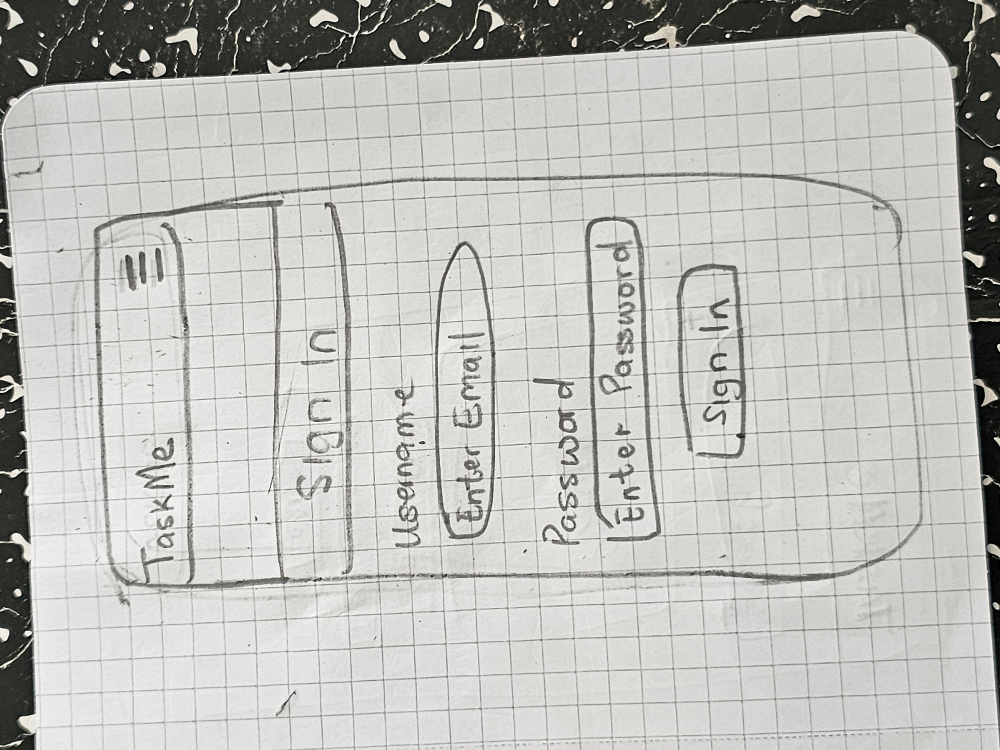

# TaskME - An Project Manager App!

## 

Taskme is one of the best productivity platforms on the market. Available via mobile app, desktop app, and web browser, TaskMe provides yet another way to improve work ethic and productivity throughout the day. With TaskMe, team members can check their to-do lists, communicate with one another in real time, collaborate on schedules,and check up on the latest project progress.
The users can register for the website and have access to more features such as Viewing the Projects and the tasks that are assignedd to all users in the group.

This part of the project is the frontend part based on the React framework, it consist of the user interface that connects and interact with the backend API through http requests.

[View the live project here.](https://taskme-9502ad.netlify.app)

### Links to the Backend API Project

- [Backend - Repository](https://github.com/diddyjax19/Project5-taskmeBackEnd)
- [Backend - Deployment](https://taskit-Diddy.pythonanywhere.com)

## Table of Contents

- [User Experience (UX)](https://github.com/diddyjax19/Taskit-FrontEnd#user-experience-ux)
  - [User Stories](https://github.com/diddyjax19/Taskit-FrontEnd#user-stories)
  - [Agile Methodology](https://github.com/diddyjax19/Taskit-FrontEnd#agile-methodology)
  - [Design](https://github.com/diddyjax19/Taskit-FrontEnd#design)
  - [Wireframes](https://github.com/diddyjax19/Taskit-FrontEnd#wireframes)
- [Features](https://github.com/diddyjax19/Taskit-FrontEnd#features)
  - [Future Features](https://github.com/diddyjax19/Taskit-FrontEnd#future-features)
- [Technologies Used](https://github.com/diddyjax19/Taskit-FrontEnd#technologies-used)
  - [Languages Used](https://github.com/diddyjax19/Taskit-FrontEnd#languages-used)
  - [Frameworks Used](https://github.com/diddyjax19/Taskit-FrontEnd#frameworks-used)
- [Testing](https://github.com/diddyjax19/Taskit-FrontEnd#testing)
  - [Bugs](https://github.com/diddyjax19/Taskit-FrontEnd#bugs)
    - [Bugs](https://github.com/diddyjax19/Taskit-FrontEnd#Bugs)
- [Deployment](https://github.com/diddyjax19/Taskit-FrontEnd#deployment)
  - [Forking the GitHub Repository](https://github.com/diddyjax19/Taskit-FrontEnd#forking-the-github-repository)
  - [Making a Local Clone](https://github.com/diddyjax19/Taskit-FrontEnd#making-a-local-clone)
  - [Deploying with Netlify](https://github.com/diddyjax19/Taskit-FrontEnd#deploying-with-Netlify)
- [Credits](https://github.com/diddyjax19/Taskit-FrontEnd#credits)
  - [Code](https://github.com/diddyjax19/Taskit-FrontEnd#code)
  - [Media](https://github.com/diddyjax19/Taskit-FrontEnd#media)
  - [Acknowledgments](https://github.com/diddyjax19/Taskit-FrontEnd#acknowledgments)

## User Experience (UX)

The project was created in order to offer a  Taskmanger app where users on a given network can add projects,add users to the network,create a task in the project,assign a start date and due date,set priority  and state of the project.
It also allows all user see the entire projects in the workspace and the tasks.
Some criterias in achieving this goal were identified as below:

- The main experience is to build a Task manager app .
- Registered users should be to see the projects and the task assigned to them and thier team.
- Create functionality for users search for task and projects available.
- Registered users should be view each project,view the description of the project and see the Start date and the due date.
- Registered users should be able view each task in any project,view the description of the task as they are assigned,view the tasks state and thier Start date and the due date.

### User stories

- User stories can be viewed in the GitHub repository and each user story has been grouped into Epics which can be displayed on the project's [Kanban board](https://github.com/users/diddyjax19/projects/6/views/1).

### Agile methodology

- The Agile Methodology was employed throughout this project, where GitHub projects were used to create User Stories, including a list of priorities grouped into Tags. Thus, the process can be carried out with a view to the priorities of the (supposed) client.
- A lst of all issues and its labels can be found [here](https://github.com/diddyjax19/Taskit-FrontEnd/issues).

### Design

- #### Color Scheme

  I decided to incorporate a minimalistic design approach for the site. This is in order to make the content and detailed information throughout the site to stand out better to the users.

  The main color used is black that represents a calm and trustworthy color type, in order to build trust to the user.

- #### Typography

  Google Fonts was used for the font in the project. The name of the font is Poppins with a medium font weight for a stylistic impression.

- ### Wireframes

- ##### Signup Page:

  

- ##### SignIn Page:

  

- ##### Home Page:

  

- ##### Create Project Page:

  

- ##### Create Task Page:

  

- ##### View Task Page:

  

## Features

### NavBar & Search

- Contains the necessary links for navigation throughout the site.
- The searchbar makes it possible search among the various Project.
- When user is using a small screen, the NavBar toggle turns into a burger icon.

### Project List page

- Shows all the created Projects by admin.
- Shows the  Project Name created.
- Shows a brief Project description.
- Shows a button to view the project.

### Create Project page

- Contains how the admin can create project
- By clicking the + button on the home page 

- Includes pictures,start date and end date.

### Create Task page

- Contains how the admin can create Task
- Click add task button on the project creation menu.

- In this Section you can create the task,add the description,set the state of the task,assign the task to the designated user,set the start and end date and save the task.

## View Task page

- In this Section each user can view the tasks of then whole team and see who each task are assigned to.

- In this Section the user can click on any task and view all the descriptions.

##  Search Bar

- In this Section we can see thew search bar created to allow the user or admin search through the projects.

## Quick Task List

- This section shows a quick view of the tasks already created.

### Future Features

Some future features were idealized to be implemented:

- Offer more search options with filters based on different criteria.
- Ability for users on the same platform to interact to each other,like a chat system between users on the same platform.
- 

## Technologies Used

### Languages

- JavaScript
- HTML5
- CSS3

### Frameworks, Libraries & Programs Used

- [React](https://reactjs.org/) - (Front-end JavaScript library for building user interfaces based on UI components)
- [React Bootstrap](https://react-bootstrap.github.io/) - Component-based library that provides native Bootstrap components as pure React components[1](https://www.pluralsight.com/guides/how-to-set-up-a-react-bootstrap-app). Used to create a responsive application/component UI.
- [Axios](https://axios-http.com/) - Promise based HTTP client for the browser and node.js. Used to make HTTP requests from throughout the application.
- [jwt-decode](https://github.com/auth0/jwt-decode) - Used to decode and extract information from a JWT token.
- [react-router-dom](https://www.npmjs.com/package/react-router-dom) - Routing library for the React Javascript library. Used to display different components based on the URL entered in the browser.
- [web-vitals](https://www.npmjs.com/package/web-vitals) - is a tiny (~1.5K, brotli'd), modular library for measuring all the Web Vitals metrics on real users, in a way that accurately matches how they're measured by Chrome and reported to other Google tools
- [reactstrap](https://reactstrap.github.io/) -  It is a tool that makes it easier to use Bootstrap components in React.
- [react-toastify](https://www.npmjs.com/package/react-toastify) - allows you to add notifications to your app with ease.
- [react-scripts](https://www.npmjs.com/package/react-scripts) -  a set of scripts from the create-react-app starter pack which helps you kick off projects without configuring
- [Git](https://git-scm.com/) - Git was used for version control, using the terminal to commit to Git and Push to GitHub.
- [GitHub:](https://github.com/) - GitHub is used to store the projects code after being pushed from Git.
- The following modules were installed or enabled in Gitpod to assist with formatting and code linting:

  - [ESLint](https://eslint.org/) - Code Linter.
  - [Prettier](https://prettier.io/) - Code Formatting.

## Testing

### Navigation-test

1. Access the navigation bar on every page and easily navigate to the different sections of the website. - PASS
2. by Clicking the email you can return to the home page. - PASS
3. Search for keywords in the search bar to find the Project and Task. - PASS

### Project

1. Create Projects - PASS
2. Edit the description of the project,added the start date and end date. - PASS
3. Create Task. PASS
4. Create a Task,description,the state of the project,the project description and the start date and end date.. - PASS

### Authentication

1. Register account. - PASS
2. Login and logout. - PASS

## Code Validation

### JSX

The JSX code was validated during the development process and corrected as the project proceeded.

### CSS

Checked the CSS syntax at the W3C CSS Validator Service and the results came with no errors.

### Lighthouse Scores

The Lighthouse Scores of Google Dev Tools was used for perfoemance tests. The performance metrics however were impacted by the large image sizes, ahtough all of them were resized before uploaded. For future updates I will investigate possibilities to have cloudinary to resize the images on upload automatically to speed up the site.

- Main Page Desktop.

- Main Page Mobile.

### Responsiveness

The website was thoroughly tested using the [responsivetesttool.](https://responsivetesttool.com/)

### Bugs

#### Fixed Bugs

- Unhandled rejection (TypeError) cannit read properties of undefined (reading 'status')

- Solution
- Used Django rest framework serializer class

## Deployment

### Forking the GitHub Repository

1.  Go to [the project repository](https://github.com/diddyjax19/Taskit-FrontEnd)
2.  In the right most top menu, click the "Fork" button.
3.  There will now be a copy of the repository in your own GitHub account.

### Running the project locally

1.  Go to [the project repository](https://github.com/diddyjax19/Taskit-FrontEnd)
2.  Click on the "Code" button.
3.  Choose one of the three options (HTTPS, SSH or GitHub CLI) and then click copy.
4.  Open the terminal in you IDE program.
5.  Type `git clone` and paste the URL that was copied in step 3.
6.  Press Enter and the local clone will be created.

### Alternatively by using Gitpod:

1.  Go to [the project repository](https://github.com/diddyjax19/Taskit-FrontEnd)
2.  Click the green button that says "Gitpod" and the project will now open up in Gitpod.

### Deploying with Netlify

1.  Go to [https://www.netlify.com/](https://www.netlify.com/) and log in; if you do not already have an account then you will need to create one.

#### Netlify Deployment

1.  On Netlify’s dashboard, select the Site tab. Next, click on Add new site and then select Deploy manually from the drop-down menu options.

2.  In the drag-and-drop feature page, select the folder containing the React build files and drop it into this user interface. The project will instantly deploy on Netlify.

*  Alternatively, you can click on Browse to upload to select your build folder from the file system. On Netlify’s dashboard, select the Site tab. Next, click on Add new site and then select Deploy manually from the drop-down menu options.

# Functional components used 
1. `const PrivateRoute()`: regulate access to certain routes depending on if user is authenticated or not
2. `const PageNotFound()`: displays in place of 404 Error (page not found)
3. `const axiosInstance()`: To get data from API page
4. `const CreateProject()`: handle creation of new project
5. `const CreateSubTask()`: functional component to handle the creation of new subtasks' name, description, start_date, end_date, state,setAssignedTo
6. `const CreateTask()`: functional component to handle the creation of new tasks' name, description, start_date, end_date, state, setAssignedTo and project related to
7. `const ProjectDetail()`: handle project details such as edit or delete project
8. `const ProjectHome()`: project's home page that renders project's id, avatar, nameproject, description with search and filter functionlities
9. `const SubTaskDetail()`:handles details of subtasks including edit, delete and set assigned to functions
10. `const TaskDetails()`: renders specific task details including editing
11. `const TaskLists()`: renders the total lists of tasks by id, name, assigned_to, name, state, end_date and a lists of incompleted tasks  
12. `const BasicForm()`: To render signUp form
13. `const Header.js()`: For page header and navbar and selectively displays navbar items depending on user authentication state
14. `const Loader.js()`: Simple spin loader to render in cases where data is not been retrieved from backend
15. `const ProjectCard()`: Displays a single projects image, name, description and link to view details of project 
16. `const ProjectGrid()`: Component to create, edit or delete project if user is admin or view available projects for other users
17. `const SubTaskGrid()`: create, edit or delete tasks depending on user status
18. `const TaskGrid()`: change task state, edit task, assign to, start_date, end_date if is staff, and create task  

## Credits

### Online Documentation

- [React documentation](https://reactjs.org/docs/getting-started.html)
- [React Bootstrap documentation and examples](https://react-bootstrap.github.io/)

### Code

- The Moments tutorial by Code institute was used to create the foundations on which I built upon to create the project.

### Media

- The images used throughout the project are from [https://unsplash.com/de/](https://unsplash.com/de)

### Acknowledgements

- The tutor support team at Code Institute for their support.
- My Code Institute Mentor, the best one that CI could have. All feedbacks, help and suggestions were very helpful to me - thank you, Martina Terlevic!
- The Code Institute Slack community.
